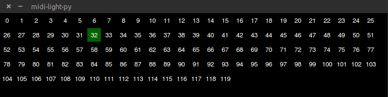
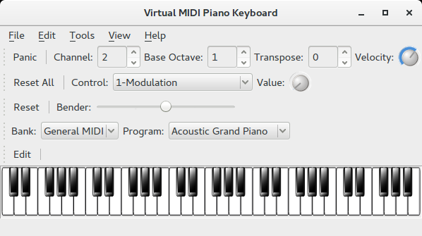

# midi-light-py
A wall mounted ambient light panel that responds to your MIDI based keyboard. It is a Raspberry PI based projected written in Python.

# Overview
Add some visual effects to your tunes by attaching an LED strip and Raspberry PI to your MIDI keyboard. The MIDI output is used as an input 
to the RPI and processed in real-time to create various mood effects. In this project I created a "floating" wooden panel to hide the LED
strip and blend in with the environment. The LEDs also project onto the wall for greater visual effect.

# Installation

Clone the repo locally on your Raspberry PI. This repository uses Git submodules (for the Adafruit library).

```
git clone https://github.com/dodgyrabbit/midi-light-py.git
```

If the /lib folder is empty, use the commands below to update. Newer versions of Git automatically pulls them during initial clone, so this step won't be needed.
```
git submodule init
git submodule update
```

The only tricky part is to install [python-rtmidi](https://spotlightkid.github.io/python-rtmidi/index.html)

## Linux
You will need to build it on Linux (and your RPI). In order to build, it needs various header files.
On my Ubuntu and Raspbian the following commands installed all the prerequisites.

```
sudo apt-get install build-essential python-dev libasound2-dev libjack-jackd2-dev
```

## Windows
You need the Visual C++ build tools on Windows. You should be able to find it [here](http://landinghub.visualstudio.com/visual-cpp-build-tools) or just install Visual Studio Express.

Now install Python packages and build python-rtmidi:

```
pip install -r requirements.txt
```

To start:
```
python midilightpy/main.py
```

## Developing on Linux

To develop and test this on your desktop Linux, you'll need to install two more software packages:

### python-tk (TKinter)
This is required by the graphics.py library and I created a small simulator that shows the LED states as blocks on screen.
```
sudo apt-get install python-tk
```
Each numbered block represents an LED on your DotStar LED strip. The color of the block is black (for off) or the corresponding RGB color when it's lit.


### vmpk (Virtual Midi Piano Keyboard)

VMPK makes it possible to generate MIDI input without having to attach a real MIDI device to your machine. This makes it really convenient to test out new visualizations or features before deploying it to your RPI.

```
sudo apt-get install vmpk
```


## Hardware
* [Raspberry Pi](https://www.raspberrypi.org/) - I'm using a RPI 1 but newer PIs will work too. 
* [DotStar LED Strip 60 LED] (https://www.adafruit.com/products/2239) - A full size Piano is about 1.5 M with 88 keys. At 60 LEDs per M this gives you about the correct density to have an LED per note on a full size Piano. I used the remaining LEDs to light up the bottom part of the light fixture.
* [5V 10A switching power supply](https://www.adafruit.com/products/658) - Probably overkill but I want to be able to drive all LEDs (60mA each) at full strength as a nice backlight.
* [USB-MIDI interface] (http://www.ebay.com/itm/New-USB-IN-OUT-MIDI-Interface-Cable-Converter-to-PC-Music-Keyboard-Adapter-Cord-/361501225810) - This cheap interface seems to work just fine.

Note that AdaFruit recommends a [level shifter](https://www.adafruit.com/products/1787) be used since the RPI GIO pins are 3.3V but the DotStar LED strip expects 5V. However, I found that with this level shifter the
first LED on my strip would misbehave and I got strange results. It turns out that the DotStar worked perfectly fine without it.

## Wall mount
* A wooden light fixture that houses the RPI and LED lights and attaches to the wall.
* The fixture appears to float on the wall and the LED strip is at the top (the part that responds to notes) and a bottom light for status or reading your music.

## Software Dependencies
|Package|Description|
|-------|-----------|
| [mido](https://github.com/olemb/mido) | A Python library that allows you to parse and work with MIDI messages. mido = Midi Objects. |
| [rtmidi-python](https://github.com/superquadratic/rtmidi-python) | mido uses **Backend**s, which are just wrappers around a particular midi drivers. I used the rtmidi Backend (as recommended) so you need to get rtmidi-python installed. This was the only real tricky part as it needs to be compiled and you need all the dependencies for that to work installed as per the instructions above. |
| [graphics.py](http://mcsp.wartburg.edu/zelle/python/graphics.py) | Graphics.py is used to simulate the LED strip. This saves a bit of time because developing directly on the RPI is a little more challenging (although I did a lot of that). |
| [vmpk](http://vmpk.sourceforge.net/) | Virtual Midi Piano Keyboard. Graphical keyboard used to simulate Midi device. |

## About
* The project was mostly developed on Linux using [Visual Studio Code](http://code.visualstudio.com/).
* The software is written in Python.
* On the RPI itself I used nano. It supports syntax hilighting and I can easily SSH in and start making changes. However, in your home directory, create a `.nanorc` file and add these two lines to it:
```
set tabsize 4
set tabstospaces
``` 

### Quick test
To verify if your USB device is working properly, run the following quick Python test

```python
import mido
backend = mido.Backend('mido.backends.rtmidi')
print backend.get_input_names()
```
If you get something like this
`[u'Midi Through Port-0', u'USB2.0-MIDI MIDI 1']`
you're golden. The **USB2.0-MIDI MIDI 1** is what you want to see (on a Linux Desktop.)
On the RPI the string was similar to "MIDI 1".

### Running on RPI

SSH into the RPI and run `nohup python main.py &`
This should start your python program in the background and return to the console. You can disconnect your SSH.

Once it's running, you may want to login later, stop the program and update the code etc.
`ps -ax | grep pyth`
This should show the the process running Python. Identify the process by name and then terminate it:
`kill <processid>`

### Setting it up to auto start

Edit the `/etc/rc.local` file and add the following line

`python home/pi/midi-light-py/midilightpy/main.py &`

This should start up the Python program whenever the RPI restarts

# Running unit tests

From the root directory, run
` python -m unittest discover -v`
You should see something like this

```
test_keypress_is_complete (tests.test_animation.AnimationTest)
Test that an animation with two LEDs has one on and one off ... ok
test_keypress_one_key (tests.test_animation.AnimationTest)
Test that an animation with one key returns a LED that is on ... ok
test_keypress_two_keys (tests.test_animation.AnimationTest)
Test that an animation with two LEDs has one on and one off ... ok
test_running_key_press (tests.test_animation.AnimationTest)
Test that pressing a key creates new animations ... ok

----------------------------------------------------------------------
Ran 4 tests in 0.005s
````


